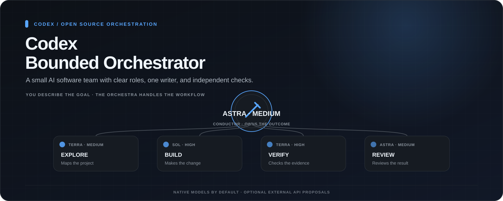
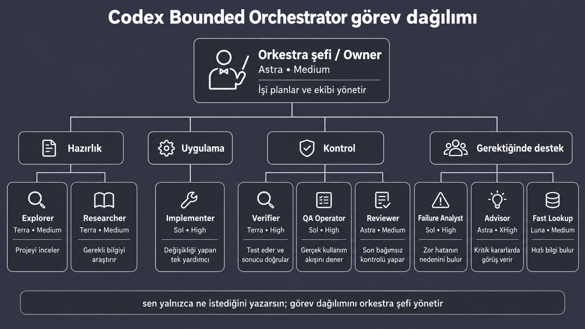
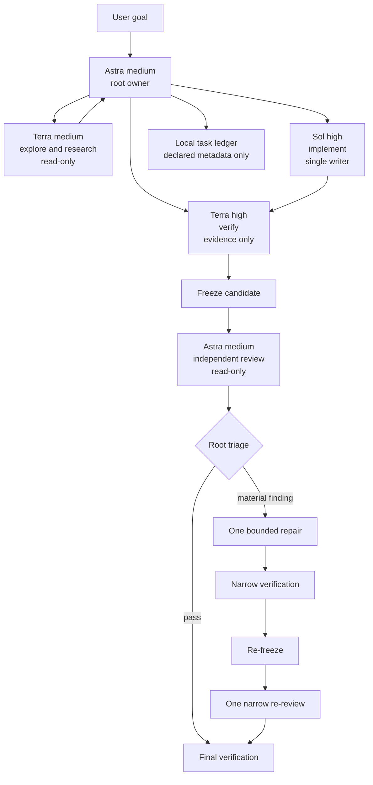

[English](README.md) | [Türkçe](README.tr.md)

<p align="center">
  
</p>

# Codex Bounded Orchestrator

[](LICENSE)
[](https://www.python.org/downloads/)

**A project-scoped Codex workflow for complex repository work: one accountable owner, one writer per scope, independent verification, and a finite review loop.**

Codex Bounded Orchestrator packages agent profiles, task contracts, review rules, and local integrity tooling into a safe-to-preview installer. Astra owns the outcome, Terra maps and verifies, Sol implements and diagnoses, and Luna is reserved for exact read-only lookups.

It is designed to make multi-agent work easier to inspect and stop. The repository configures guardrails; prompts alone are not a security boundary, and Codex clients may differ in how they apply settings.

> [!NOTE]
> This is an unofficial community project. It is not affiliated with or endorsed by OpenAI.

## Why use it?

- Keep one root owner responsible from task intake through final verification.
- Give each implementation scope to one writer at a time.
- Separate investigation, implementation, verification, and review.
- Freeze a candidate before independent review and detect later file changes.
- Track declared work, stable attempts, interruptions, and one bounded retry in a local metadata-only ledger before review.
- Report locally observed model/token counters without reading or printing prompt content.
- Optionally require an explicitly invoked local evaluation before review.
- Add opt-in UI design or security review guidance without expanding authority.
- Cap retries, writer turns, repair cycles, and re-reviews.
- Preview installation and preserve existing project configuration by default.

## Architecture



The visual overview uses short Turkish labels; the diagram below shows the same core workflow in English.



Optional paths: Luna medium for `fast_lookup`, Sol high for `failure_analyst` and `qa_operator`, and Astra xhigh for one framed `advisor` decision. See the [full architecture](docs/architecture.md).

## Quick start

Requirements: Git, Python 3.11 or newer, a Codex client that supports project-scoped configuration and custom agents, and access to the configured models in your plan or workspace.

```bash
git clone https://github.com/metapak/codex-bounded-orchestrator.git
cd codex-bounded-orchestrator

# Preview every planned action first.
python3 scripts/install.py /absolute/path/to/your-project --preset balanced --dry-run

# Install after reviewing the preview.
python3 scripts/install.py /absolute/path/to/your-project --preset balanced

# Open the interactive profile/model/effort selector for a known target path.
./setup.command /absolute/path/to/your-project
```

When `setup.command` receives only a target path, it opens the interactive selector. Commands containing explicit options are passed through unchanged for advanced or automated use.

Start a fresh Codex session in the target project, then invoke:

```text
$bounded-orchestrator

Implement idempotency for invoice creation.
Map the request and persistence path first.
Do not push, merge, or deploy.
```

Run the [runtime smoke test](docs/runtime-smoke-test.md) before relying on the routing in real work.

## Platform entry points

These entry points are supplied by the repository. Runtime behavior still depends on your local Python, shell, Codex version, and model access.

| Platform | Supplied entry points | Guide |
|---|---|---|
| macOS | `setup.command`, `scripts/install.sh`, `scripts/install.py` | [macOS installation](INSTALL-MACOS.md) |
| Windows | `setup.cmd`, `setup.ps1`, `scripts/install.ps1`, `scripts/install.py` | [Windows installation](INSTALL-WINDOWS.md) |
| Linux | `scripts/install.sh`, `scripts/install.py` | Use the [quick start](#quick-start) and `--help` |

The installer uses only the Python standard library. Its guided three-step display explains each choice, states the native brand boundary, and shows a final configuration review before writing files. One-click setup offers `balanced`, `quality`, `economy`, `quota-saver`, and `custom` presets. These names describe routing intent, not benchmarked guarantees. All native roles remain on OpenAI `gpt-*` models, including custom profiles. Other brands are available only as explicit API-backed proposal tools. The legacy `--profile astra|sol` flag remains supported; automation can use `--preset`, repeated `--role-model ROLE=MODEL`, and `--role-effort ROLE=EFFORT` flags.

See the exact [profile routing table](docs/profiles.md).

## Optional external API proposal role

The default is no external provider. When explicitly selected, Codex can ask Claude (`anthropic`) or DeepSeek (`deepseek`) for a bounded patch proposal through a local stdio MCP bridge. The bridge receives only the task, supplied context, constraints, and allowed paths; it cannot read or write the workspace. The native GPT implementer remains the sole writer that reviews and applies accepted changes.

Set `ANTHROPIC_API_KEY` or `DEEPSEEK_API_KEY` only in the environment that starts Codex. The installer stores only the environment-variable name and never stores the key. Provider API use may be billed separately. Prepared choices include Claude Sonnet/Opus and DeepSeek V4.1 Flash (`deepseek-flash`); a provider-family custom model ID is also accepted.

```bash
export ANTHROPIC_API_KEY="your-key"
python3 scripts/install.py /absolute/path/to/your-project \
  --preset balanced --external-provider anthropic \
  --external-model claude-sonnet-5 --external-effort high

# Or select the current DeepSeek V4.1 Flash API alias.
export DEEPSEEK_API_KEY="your-key"
python3 scripts/install.py /absolute/path/to/your-project \
  --preset balanced --external-provider deepseek \
  --external-model deepseek-flash --external-effort high
```

See [external provider setup and boundaries](docs/external-providers.md).

## What gets installed

- Explicit role registrations and one profile file per role under `.codex/agents/`.
- The `$bounded-orchestrator` skill and its task, review, and escalation contracts.
- `.codex/tools/candidate.py` for candidate hashes and Git identity.
- `.codex/tools/ledger.py` for ignored local task metadata and completion gates.
- Two opt-in expertise packs: UI design and security review.
- A marked, updateable block in the target project's `AGENTS.md`.
- A local install manifest and ignored backup directory for safe updates and uninstall.

If `.codex/config.toml` already exists, the default install preserves it and writes `.codex/bounded-orchestrator.config.example.toml` for manual merging. Conflicting managed files are skipped unless `--force` is supplied. `--force-config` separately opts into replacing root config after a local backup.

Useful commands:

```bash
# Replace conflicting managed role, skill, or tool files after backing them up.
python3 scripts/install.py /path/to/project --profile astra --force

# Remove only unmodified installer-owned files and the managed AGENTS.md block.
python3 scripts/install.py /path/to/project --uninstall

# Freeze and later verify the candidate from the installed project.
python3 .codex/tools/candidate.py freeze --label pre-review
python3 .codex/tools/candidate.py verify

# Track declared required work without storing prompts, source, or logs.
python3 .codex/tools/ledger.py start feature-123 --title "Short goal label"
python3 .codex/tools/ledger.py add implement --title "Implement the change"
python3 .codex/tools/ledger.py status
```

See the [task ledger guide](docs/task-ledger.md) and [expertise pack guide](docs/expertise-packs.md). The ledger can detect unresolved declared work, but it cannot prove that every necessary task was declared. Expertise packs are instructions, not enforcement or additional permission.

## Guardrails and their limits

| Control | How it is supplied | Practical limit |
|---|---|---|
| No recursive child delegation | Agent config disables child agents; role prompts also prohibit delegation | Depends on the Codex client honoring the loaded project config |
| One writer per scope | Owner and implementer task contracts | A procedural rule; it does not lock files at the operating-system level |
| Read-only reviewer | Reviewer sandbox default plus findings-only instructions | Live permissions can vary by client, trust state, and parent policy |
| Finite review loop | Skill state machine and explicit budgets | The root must follow the workflow; prompts do not enforce a global scheduler |
| Candidate integrity | Local tool records hashes and verifies the frozen file set | Detects changes; it does not prevent edits or prove code correctness |
| Declared-work gate | Local ledger validates task states and dependencies before review/completion | Finds unresolved declared work; it cannot discover work that was never declared |
| Opt-in expertise | Separate UI design and security review skill packs | Adds instructions only; it does not change permissions, roles, or enforcement |
| Safer installation | Code preserves conflicts, supports dry-run, backs up forced replacements, and tracks owned files | Review the preview and backups; it is not a substitute for version control |

The underlying Codex sandbox, operating-system permissions, repository protections, and human authorization remain the enforcement layers. After client upgrades, rerun the smoke test and report unobservable metadata as unknown.

## Learn more

- [Examples](docs/examples.md): feature work, cross-component debugging, high-risk changes, and root-only tasks
- [FAQ and troubleshooting](docs/faq.md)
- [Roadmap](docs/roadmap.md)
- [Architecture details](docs/architecture.md)
- [Runtime smoke test](docs/runtime-smoke-test.md)
- [Task ledger](docs/task-ledger.md) and [expertise packs](docs/expertise-packs.md)
- [Usage reporting and optional local evaluation](docs/usage-and-local-eval.md)
- [Routing profiles](docs/profiles.md) and [external provider bridge](docs/external-providers.md)
- [v0.6.0 release notes](docs/release-v0.6.0.md) and [latest release](https://github.com/metapak/codex-bounded-orchestrator/releases/latest)
- [Source provenance](docs/provenance.md)

## Development

```bash
python3 scripts/validate.py
python3 -m unittest discover -s tests -v
python3 scripts/build_release.py --output-dir dist
```

Contributions are welcome. Read [CONTRIBUTING.md](CONTRIBUTING.md), review the [security policy](SECURITY.md), and check the [changelog](CHANGELOG.md) before opening a pull request.

If this workflow makes your Codex work clearer or safer to review, a GitHub star helps other developers find it.

## License and attribution

Licensed under Apache-2.0. See [LICENSE](LICENSE) and [NOTICE](NOTICE).

This project is a ground-up redesign inspired by [donvito/codex-astra-luna-orchestrator](https://github.com/donvito/codex-astra-luna-orchestrator), which is also distributed under Apache-2.0. See [NOTICE](NOTICE) and the [design differences](docs/from-astra-luna-orchestrator.md) for attribution and context.
