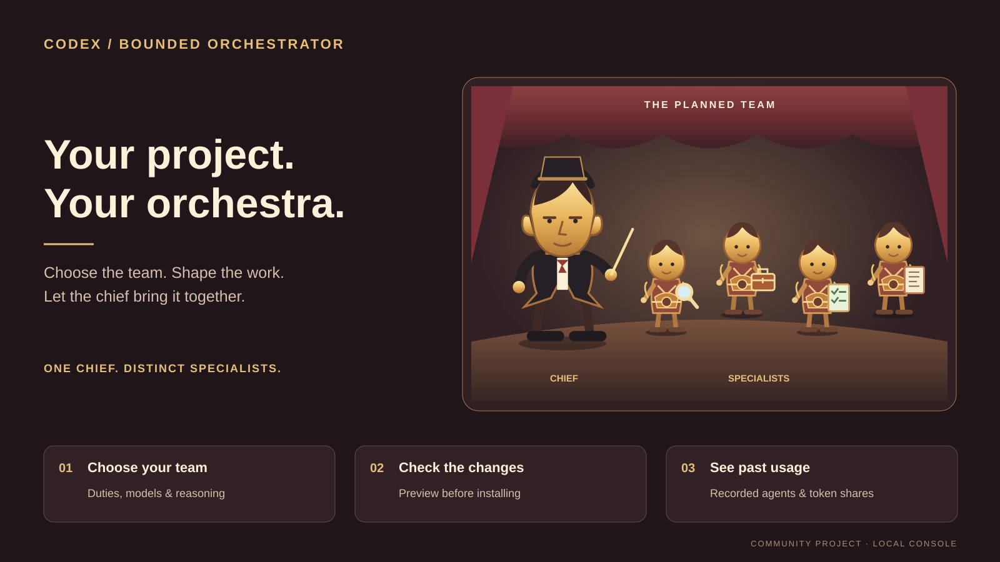
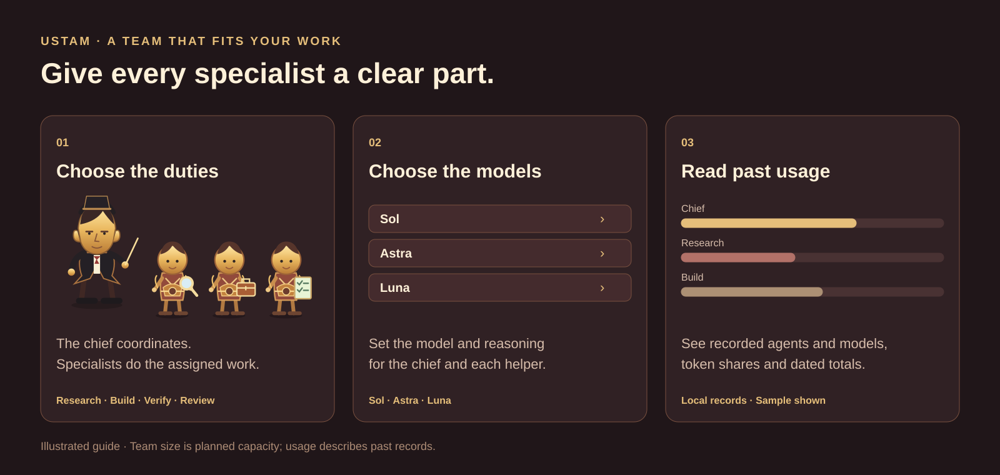
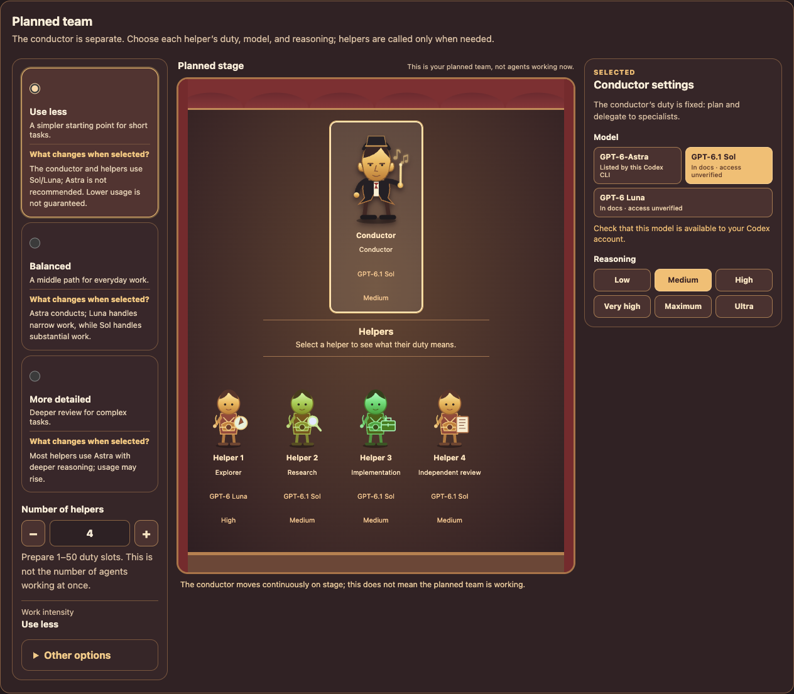
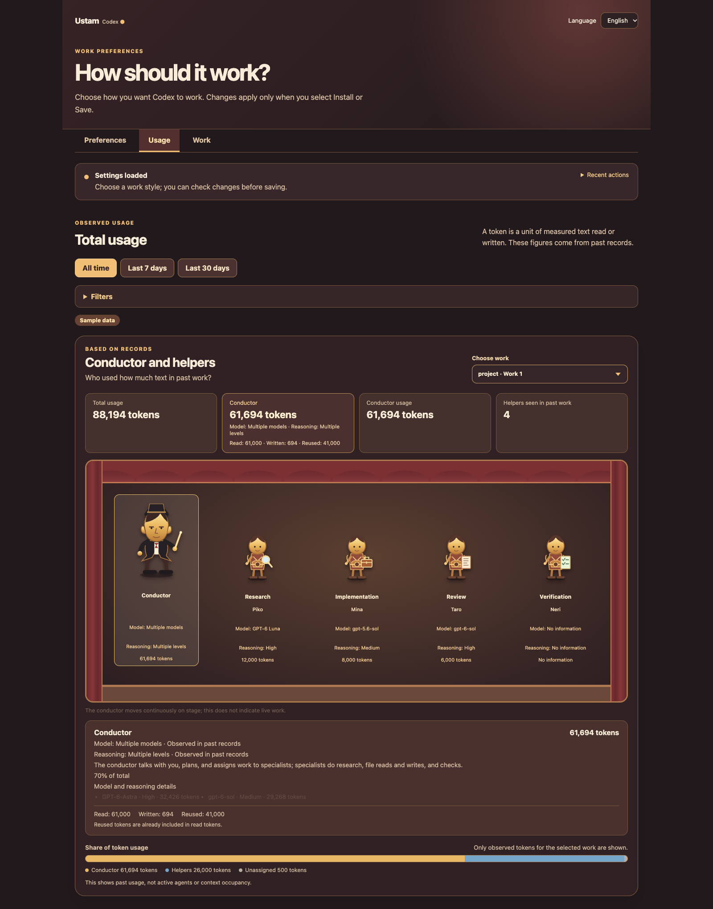
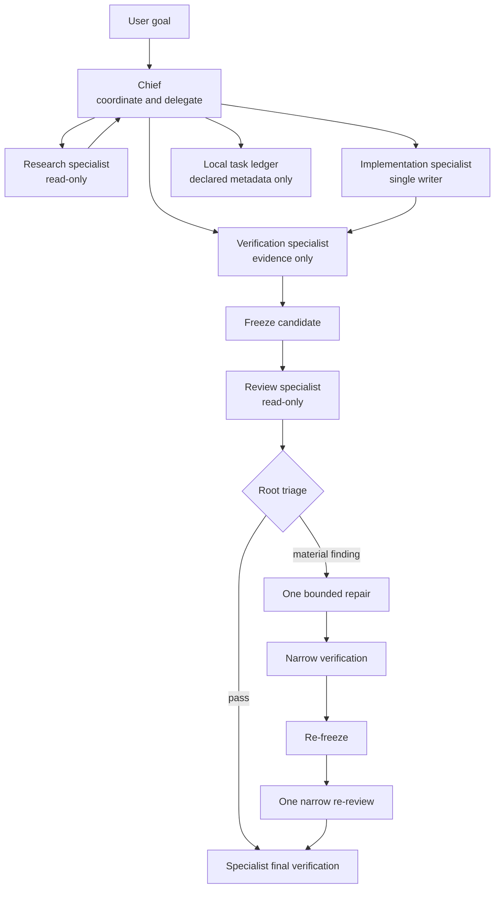

[English](README.md) | [Türkçe](README.tr.md)

<p align="center">
  
</p>

# Ustam

The Codex edition of Ustam.

[](LICENSE)
[](https://www.python.org/downloads/)

**Choose a chief and a specialist team for your Codex project in a local browser page.**

Set up the team, check the changes, and see locally recorded past usage. The setup console runs on your computer. The chief coordinates and speaks with you; specialists do the assigned work. This division is an instruction rule, not a technical lock on the chief's tools.

> [!NOTE]
> This is an unofficial community project. It is not affiliated with or endorsed by OpenAI.

## Install in four steps

Have Codex, [Git](https://git-scm.com/downloads), and [Python 3.11 or newer](https://www.python.org/downloads/) installed first. Python is **not included** in this download.

1. **Download:** [Get the current ZIP](https://github.com/metapak/codex-bounded-orchestrator/archive/refs/heads/main.zip) and open the extracted folder.
2. **Open:** On Mac, open `launchers` and double-click **Ustam.app**. On Windows, double-click **Launch Ustam.vbs** in the same folder. On Linux, use the short command below.
3. **Choose a project:** On Mac or Windows, pick the Git project folder where you use Codex. On Linux, the command includes that folder instead.
4. **Install:** In the browser, keep the suggested team or change it. Click **Check changes**, then **Install**. Restart Codex in that project.

<details>
<summary>Linux: open the same setup page</summary>

Linux has no double-click launcher or folder picker in this package. Open a terminal in the extracted folder, then run this with your Git project's path:

```bash
python3 scripts/dashboard.py /absolute/path/to/your-git-project
```

</details>

To change the team later, open the launcher again (or repeat the Linux command) and use **Save**. It updates the project settings without uninstalling. You may need to reopen an active Codex session before it uses the changes. If setup does not open, see the [Mac](INSTALL-MACOS.md) or [Windows](INSTALL-WINDOWS.md) guide. Your Codex client must support project settings and custom agents, and your account must have access to the selected models.

## Build your orchestra



Choose a chief or helper on the stage to set their model and reasoning. Each helper also has a duty; the planned team gives the chief capacity to call specialists when needed.



*Current console with an example project. The highlighted model is a setup choice; access depends on your Codex account.*

## Watch Ustam in 40 seconds

[](https://raw.githubusercontent.com/metapak/codex-bounded-orchestrator/main/docs/assets/ustam-promo-en-40s.mp4)

[Play or download the English video (MP4)](https://raw.githubusercontent.com/metapak/codex-bounded-orchestrator/main/docs/assets/ustam-promo-en-40s.mp4). A 40-second introduction to Ustam, with English titles and music. The console and usage figures are illustrative sample data. If GitHub does not show an inline player, select the poster or MP4 link to open the original video.



*Current console with sanitized sample records. Token totals describe past usage; the orchestra animation is an illustration.*

<details>
<summary>Advanced: command-line setup and skill invocation</summary>

The terminal installer remains available for automation, but the per-helper team builder is in the browser console.

```bash
git clone https://github.com/metapak/codex-bounded-orchestrator.git
cd codex-bounded-orchestrator
python3 scripts/install.py /absolute/path/to/your-project --preset balanced --dry-run
python3 scripts/install.py /absolute/path/to/your-project --preset balanced
```

Start a fresh Codex session in the selected project, then invoke `$bounded-orchestrator` for repository work. Run the [runtime smoke test](docs/runtime-smoke-test.md) before relying on model routing.

The technical skill name `$bounded-orchestrator`, installation markers and `.codex/.bounded-orchestrator` paths stay unchanged for compatibility with existing projects.

</details>

## What does it do now?

You describe the result in normal language. The chief assigns bounded work to specialists, reads their evidence, and decides the next assignment. A specialist verifies the result and freezes the exact candidate for independent review. The workflow can preserve interruption and retry history, show locally observed token usage, require an explicit project-specific evaluation, and resume after you supply a missing decision.

The local browser console lets you install preferences in a selected Git project without typing commands on macOS or Windows. On the planned stage, choose one of ten task types or use the 1–50 planned-helper control and click an actor to choose its duty, model and compatible reasoning level; the chief has its own model and reasoning choices. Duplicate duties are allowed and become real project agent definitions. The chief remains separate; a planned team is capacity, not a command to start every helper. The simultaneous cap stays separate at 1–10; all 50 planned slots are saved, with ten shown per stage page. Task types seed an unsaved draft that can be undone. The three primary intensity styles adjust model and reasoning recommendations without changing duties or team size. Image creation still requires a capable tool or connection. The Usage page shows past observed agents, token shares and a dated strip of recorded token totals. The strip is not playback or elapsed work time. Its orchestra characters distinguish duties; clicking the chief starts a looping illustration until you click elsewhere. The illustration does not show live agent activity.

Prepared profiles let you choose balanced routing, maximum quality, lighter everyday routing, quota-saving behavior, or a custom model/effort map. Native work remains GPT-only. Claude and DeepSeek can be added only as optional proposal APIs without workspace access; the native GPT implementer still owns every accepted change.

## Why use it?

- Keep one chief responsible for coordination and user communication, while specialists execute and verify.
- Give each implementation scope to one writer at a time.
- Separate investigation, implementation, verification, and review.
- Freeze a candidate before independent review and detect later file changes.
- Track declared work, stable attempts, interruptions, and one bounded retry in a local metadata-only ledger before review.
- Report locally observed model/token counters without reading or printing prompt content.
- Optionally require an explicitly invoked local evaluation before review.
- Add opt-in UI design or security review guidance without expanding authority.
- Cap retries, writer turns, repair cycles, and re-reviews.
- Preview installation and preserve existing project configuration by default.

## Architecture

The selected helper team can change by project. This diagram shows how work moves between the chief and specialists, not a fixed model roster.


```mermaid
flowchart TD
    U[User goal] --> O["Chief<br/>coordinate and delegate"]
    O --> E["Research specialist<br/>read-only"]
    O --> I["Implementation specialist<br/>single writer"]
    O --> V["Verification specialist<br/>evidence only"]
    O --> L["Local task ledger<br/>declared metadata only"]
    E --> O
    I --> V
    V --> F[Freeze candidate]
    F --> R["Review specialist<br/>read-only"]
    R --> T{Root triage}
    T -->|pass| D[Specialist final verification]
    T -->|material finding| B[One bounded repair]
    B --> V2[Narrow verification]
    V2 --> F2[Re-freeze]
    F2 --> R2[One narrow re-review]
    R2 --> D
```

Other duties are available; their model and reasoning level depend on your selected team. See the [full architecture](docs/architecture.md).

## Platform entry points

These entry points are supplied by the repository. Runtime behavior still depends on your local Python, shell, Codex version, and model access.

| Platform | Supplied entry points | Guide |
|---|---|---|
| macOS | `launchers/Ustam.app`; `setup.command` for terminal setup | [macOS installation](INSTALL-MACOS.md) |
| Windows | `launchers/Launch Ustam.vbs`; `setup.cmd` for terminal setup | [Windows installation](INSTALL-WINDOWS.md) |
| Linux | `python3 scripts/dashboard.py /path/to/project`; `scripts/install.sh` | [Local console](docs/local-console.md) and `--help` |

The installer and console use only the Python standard library. The console previews exact changes before writing to the selected project, preserves unrelated settings, and tracks managed files and local ignored backups. Its choices include `balanced`, `quality`, `economy`, `quota-saver`, `focused`, and custom routing, depending on the entry point. These names describe intent, not measured savings or speed guarantees. Native roles use OpenAI `gpt-*` models; optional other brands are API-backed proposal tools. The legacy `--profile astra|sol` flag remains supported; automation can use `--preset`, repeated `--role-model ROLE=MODEL`, and `--role-effort ROLE=EFFORT` flags.

See the exact [profile routing table](docs/profiles.md).

## Optional external API proposal role

The default is no external provider. When explicitly selected, Codex can ask Claude (`anthropic`) or DeepSeek (`deepseek`) for a bounded patch proposal through a local stdio MCP bridge. The bridge receives only the task, supplied context, constraints, and allowed paths; it cannot read or write the workspace. The native GPT implementer remains the sole writer that reviews and applies accepted changes.

Set `ANTHROPIC_API_KEY` or `DEEPSEEK_API_KEY` only in the environment that starts Codex. The installer stores only the environment-variable name and never stores the key. Provider API use may be billed separately. Prepared choices include Claude Sonnet/Opus and DeepSeek V4.1 Flash (`deepseek-flash`); a provider-family custom model ID is also accepted.

```bash
export ANTHROPIC_API_KEY="your-key"
python3 scripts/install.py /absolute/path/to/your-project \
  --preset balanced --external-provider anthropic \
  --external-model claude-sonnet-5-5 --external-effort high

# Or select the current DeepSeek V4.1 Flash API alias.
export DEEPSEEK_API_KEY="your-key"
python3 scripts/install.py /absolute/path/to/your-project \
  --preset balanced --external-provider deepseek \
  --external-model deepseek-flash --external-effort high
```

See [external provider setup and boundaries](docs/external-providers.md).

## What gets installed

- Explicit role registrations and one profile file per role under `.codex/agents/`.
- When saved through the console, one installer-managed `team-slot-XX.toml` agent file for each selected helper.
- The `$bounded-orchestrator` skill and its task, review, and escalation contracts.
- `.codex/tools/candidate.py` for candidate hashes and Git identity.
- `.codex/tools/ledger.py` for ignored local task metadata and completion gates.
- `.codex/tools/usage_report.py` for privacy-conscious local model/token reporting.
- `.codex/tools/local_eval.py` and an example manifest for explicitly selected project checks.
- Two opt-in expertise packs: UI design and security review.
- A marked, updateable block in the target project's `AGENTS.md`.
- A local install manifest and ignored backup directory for safe updates and uninstall.

If `.codex/config.toml` already exists, the default install preserves it and writes `.codex/bounded-orchestrator.config.example.toml` for manual merging. Conflicting managed files are skipped unless `--force` is supplied. `--force-config` separately opts into replacing root config after a local backup.

Useful commands:

```bash
# Replace conflicting managed role, skill, or tool files after backing them up.
python3 scripts/install.py /path/to/project --profile astra --force

# On macOS/Linux, remove only unmodified installer-owned files and the managed AGENTS.md block.
python3 scripts/install.py /path/to/project --uninstall

# Freeze and later verify the candidate from the installed project.
python3 .codex/tools/candidate.py freeze --label pre-review
python3 .codex/tools/candidate.py verify

# Track declared required work without storing prompts, source, or logs.
python3 .codex/tools/ledger.py start feature-123 --title "Short goal label"
python3 .codex/tools/ledger.py add implement --title "Implement the change"
python3 .codex/tools/ledger.py status
```

See the [task ledger guide](docs/task-ledger.md) and [expertise pack guide](docs/expertise-packs.md). The ledger can detect unresolved declared work, but it cannot prove that every necessary task was declared. Expertise packs are instructions, not enforcement or additional permission.

## Guardrails and their limits

| Control | How it is supplied | Practical limit |
|---|---|---|
| No recursive child delegation | Agent config disables child agents; role prompts also prohibit delegation | Depends on the Codex client honoring the loaded project config |
| Chief only coordinates | Managed AGENTS block and skill instructions | A behavior rule; no verified root-only tool allowlist locks the chief out of worker tools |
| One writer per scope | Owner and implementer task contracts | A procedural rule; it does not lock files at the operating-system level |
| Read-only reviewer | Reviewer sandbox default plus findings-only instructions | Live permissions can vary by client, trust state, and parent policy |
| Finite review loop | Skill state machine and explicit budgets | The root must follow the workflow; prompts do not enforce a global scheduler |
| Candidate integrity | Local tool records hashes and verifies the frozen file set | Detects changes; it does not prevent edits or prove code correctness |
| Declared-work gate | Local ledger validates task states and dependencies before review/completion | Finds unresolved declared work; it cannot discover work that was never declared |
| Opt-in expertise | Separate UI design and security review skill packs | Adds instructions only; it does not change permissions, roles, or enforcement |
| Safer installation | Code preserves conflicts, supports dry-run, backs up forced replacements, and tracks owned files | Review the preview and backups; it is not a substitute for version control |

The underlying Codex sandbox, operating-system permissions, repository protections, and human authorization remain the enforcement layers. After client upgrades, rerun the smoke test and report unobservable metadata as unknown.

## Learn more

- [Examples](docs/examples.md): feature work, cross-component debugging, high-risk changes, and root-only tasks
- [FAQ and troubleshooting](docs/faq.md)
- [Roadmap](docs/roadmap.md)
- [Architecture details](docs/architecture.md)
- [Runtime smoke test](docs/runtime-smoke-test.md)
- [Task ledger](docs/task-ledger.md) and [expertise packs](docs/expertise-packs.md)
- [Usage reporting and optional local evaluation](docs/usage-and-local-eval.md)
- [Routing profiles](docs/profiles.md) and [external provider bridge](docs/external-providers.md)
- [Historical v0.6.0 release notes](docs/release-v0.6.0.md); use the current `main` ZIP above for the browser launcher
- [Source provenance](docs/provenance.md)

## Development

```bash
python3 scripts/validate.py
python3 -m unittest discover -s tests -v
python3 scripts/build_release.py --output-dir dist
```

Contributions are welcome. Read [CONTRIBUTING.md](CONTRIBUTING.md), review the [security policy](SECURITY.md), and check the [changelog](CHANGELOG.md) before opening a pull request.

If this workflow makes your Codex work clearer or safer to review, a GitHub star helps other developers find it.

## License and attribution

Licensed under Apache-2.0. See [LICENSE](LICENSE) and [NOTICE](NOTICE).

This project is a ground-up redesign inspired by [donvito/codex-astra-luna-orchestrator](https://github.com/donvito/codex-astra-luna-orchestrator), which is also distributed under Apache-2.0. See [NOTICE](NOTICE) and the [design differences](docs/from-astra-luna-orchestrator.md) for attribution and context.
