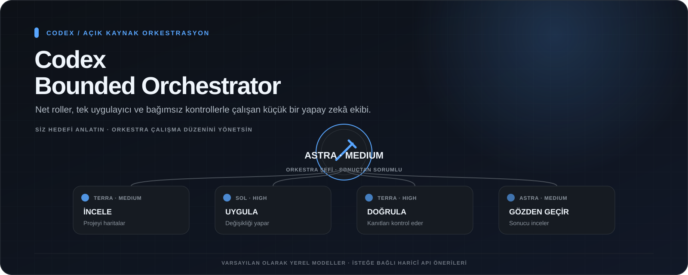
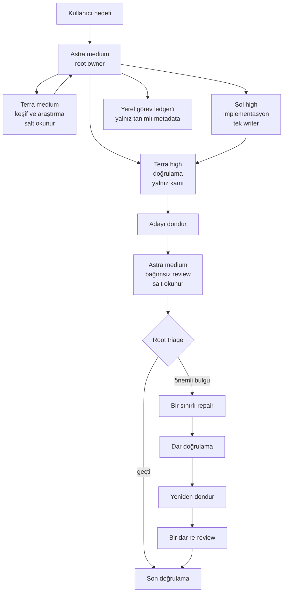

[English](README.md) | [Türkçe](README.tr.md)

<p align="center">
  
</p>

# Codex Bounded Orchestrator

[](LICENSE)
[](https://www.python.org/downloads/)

**Codex’in karmaşık repo işlerini planlamasını, dağıtmasını, uygulamasını, kontrol etmesini, ölçmesini ve güvenle devam ettirmesini sağlayan sınırlı bir çalışma katmanı.**

Codex Bounded Orchestrator; agent profillerini, görev sözleşmelerini, review kurallarını ve yerel bütünlük araçlarını önceden incelenebilen bir installer içinde sunar. Astra sonucu sahiplenir, Terra haritalar ve doğrular, Sol uygular ve kök neden analizi yapar, Luna ise yalnız kesin ve salt okunur aramalarda kullanılır.

Amaç, çok agent'lı işi daha kolay denetlenir ve durdurulabilir hâle getirmektir. Repo guardrail'leri yapılandırır; prompt'lar tek başına güvenlik sınırı değildir ve Codex istemcileri ayarları farklı biçimde uygulayabilir.

> [!NOTE]
> Bu bağımsız bir topluluk projesidir. OpenAI ile bağlantılı değildir ve OpenAI tarafından onaylanmamıştır.

## Artık ne yapıyor?

Siz istediğiniz sonucu normal şekilde anlatırsınız. Ana yönetici işi sınırlı görevlere ayırır, her aşamayı uygun GPT modeline verir, her çalışma alanında tek bir uygulayıcıyı sorumlu tutar, sonucu kontrol eder, değişmeyecek son hâli sabitler ve bağımsız incelemeye gönderir. Sistem ayrıca kesinti ve yeniden deneme geçmişini saklayabilir, hangi modellerin ve yerel olarak gözlenen tokenların kullanıldığını gösterebilir, açıkça seçilen projeye özel bir son kontrolü zorunlu tutabilir ve siz eksik kararı verdikten sonra bekleyen göreve devam edebilir.

Hazır profillerle dengeli dağılım, en yüksek kalite, daha hafif günlük kullanım, kota tasarrufu veya tamamen özel model ve efor dağılımı seçilebilir. Yerel çalışma yalnızca GPT modelleriyle devam eder. Claude ve DeepSeek, çalışma alanına erişemeyen isteğe bağlı öneri API’leri olarak eklenebilir; kabul edilen değişikliklerin sorumlusu yine yerel GPT uygulayıcıdır.

## Neden kullanılır?

- Görev başlangıcından son doğrulamaya kadar tek root owner sorumlu kalır.
- Her implementasyon kapsamında aynı anda yalnız bir writer çalışır.
- İnceleme, implementasyon, doğrulama ve review birbirinden ayrılır.
- Aday review öncesi dondurulur; sonraki dosya değişiklikleri tespit edilir.
- İnceleme öncesinde görevler, sabit denemeler, kesintiler ve tek sınırlı yeniden deneme yerel ve yalnız metadata tutan ledger ile izlenir.
- İstem içeriğini okumadan veya yazdırmadan yerel model/token sayaçları raporlanabilir.
- Açıkça çalıştırılan yerel değerlendirme isteğe bağlı olarak inceleme öncesinde zorunlu tutulabilir.
- Yetkiyi genişletmeden isteğe bağlı UI tasarımı veya güvenlik review rehberliği eklenir.
- Deneme, writer turu, repair ve re-review sayıları sınırlandırılır.
- Kurulum önceden görüntülenir ve mevcut proje config'i varsayılan olarak korunur.

## Mimari


Görsel, ana yöneticinin işi hangi modellere ve rollere dağıttığını özetler. Aşağıdaki şema ise işin uygulama ve kontrol adımlarındaki ilerleyişini gösterir.



Opsiyonel yollar: `fast_lookup` için Luna medium, `failure_analyst` ve `qa_operator` için Sol high, tek çerçevelenmiş `advisor` kararı için Astra xhigh. Ayrıntılar: [mimari dokümanı](docs/architecture.md).

## Hızlı başlangıç

Gereksinimler: Git, Python 3.11 veya üzeri, proje kapsamlı config ve custom agent destekleyen bir Codex istemcisi ve plan/workspace içinde yapılandırılan modellere erişim.

```bash
git clone https://github.com/metapak/codex-bounded-orchestrator.git
cd codex-bounded-orchestrator

# Önce yapılacak bütün işlemleri görüntüle.
python3 scripts/install.py /projenin/tam/yolu --preset balanced --dry-run

# Ön izlemeyi inceledikten sonra kur.
python3 scripts/install.py /projenin/tam/yolu --preset balanced

# Bilinen proje yolu için profil/model/efor seçim ekranını aç.
./setup.command /projenizin/tam/yolu
```

`setup.command` yalnız bir proje yolu alırsa etkileşimli seçim ekranını açar. Açık komut seçenekleri verilen gelişmiş veya otomatik kullanımlar değiştirilmeden doğrudan aktarılır.

Hedef projede yeni bir Codex oturumu aç ve şu biçimde çağır:

```text
$bounded-orchestrator

Invoice oluşturma akışına idempotency ekle.
Önce request ve persistence yolunu haritala.
Push, merge veya deploy yapma.
```

Gerçek işte bu yönlendirmeye güvenmeden önce [runtime smoke testini](docs/runtime-smoke-test.md) çalıştır.

## Platform giriş noktaları

Aşağıdaki giriş noktaları repo içinde sunulur. Gerçek çalışma davranışı yerel Python ve shell ortamına, Codex sürümüne ve model erişimine bağlıdır.

| Platform | Sunulan giriş noktaları | Rehber |
|---|---|---|
| macOS | `setup.command`, `scripts/install.sh`, `scripts/install.py` | [macOS kurulumu](INSTALL-MACOS.md) |
| Windows | `setup.cmd`, `setup.ps1`, `scripts/install.ps1`, `scripts/install.py` | [Windows kurulumu](INSTALL-WINDOWS.md) |
| Linux | `scripts/install.sh`, `scripts/install.py` | [Hızlı başlangıcı](#hızlı-başlangıç) ve `--help` çıktısını kullan |

Installer yalnız Python standart kütüphanesini kullanır. Üç adımlı yönlendirmeli ekran her seçeneği açıklar, yerel marka sınırını belirtir ve dosyalar yazılmadan önce son yapılandırma özetini gösterir. Tek tıklamalı kurulum `balanced`, `quality`, `economy`, `quota-saver` ve `custom` seçeneklerini sunar. Bu adlar yönlendirme amacını anlatır; ölçülmüş sonuç garantisi değildir. Özel profil dahil bütün yerel roller yalnız OpenAI `gpt-*` modellerini kabul eder. Diğer markalar ancak açıkça seçilen API destekli öneri araçlarıdır. Eski `--profile astra|sol` seçeneği çalışmaya devam eder; otomasyonlarda `--preset`, tekrarlanabilir `--role-model ROL=MODEL` ve `--role-effort ROL=EFOR` seçenekleri kullanılabilir.

Tam dağılım için [profil yönlendirme tablosuna](docs/profiles.tr.md) bak.

## İsteğe bağlı haricî API öneri rolü

Varsayılan seçimde haricî sağlayıcı yoktur. Açıkça seçilirse Codex, yerel stdio MCP köprüsü üzerinden Claude (`anthropic`) veya DeepSeek (`deepseek`) modelinden sınırlı bir yama önerisi alabilir. Köprü yalnız görevi, verilen bağlamı, kısıtları ve izinli yolları görür; çalışma alanını okuyamaz veya yazamaz. Öneriyi inceleyip kabul edilen kısmı uygulayan tek writer yerel GPT implementer olarak kalır.

Codex'i başlatmadan önce seçime göre `ANTHROPIC_API_KEY` veya `DEEPSEEK_API_KEY` ortam değişkenini tanımla. Installer anahtarı kaydetmez; yalnız ortam değişkeninin adını config'e yazar. Sağlayıcı API kullanımı ayrıca ücretlendirilebilir. Hazır seçenekler arasında Claude Sonnet/Opus ve DeepSeek V4.1 Flash (`deepseek-flash`) bulunur; aynı sağlayıcı ailesinden özel model kimliği de girilebilir.

```bash
export ANTHROPIC_API_KEY="anahtarın"
python3 scripts/install.py /projenin/tam/yolu \
  --preset balanced --external-provider anthropic \
  --external-model claude-sonnet-5 --external-effort high

# Veya güncel DeepSeek V4.1 Flash API adını seç.
export DEEPSEEK_API_KEY="anahtarın"
python3 scripts/install.py /projenin/tam/yolu \
  --preset balanced --external-provider deepseek \
  --external-model deepseek-flash --external-effort high
```

Ayrıntılar için [haricî sağlayıcı kurulumu ve sınırlarına](docs/external-providers.tr.md) bak.

## Neler kurulur?

- `.codex/agents/` altında açık rol kayıtları ve her rol için ayrı profil.
- `$bounded-orchestrator` skill'i ile görev, review ve escalation sözleşmeleri.
- Candidate hash'leri ve Git kimliği için `.codex/tools/candidate.py`.
- Ignore edilen yerel görev metadata'sı ve tamamlanma kontrolleri için `.codex/tools/ledger.py`.
- İstem veya kod içeriğini göstermeyen yerel model/token raporu için `.codex/tools/usage_report.py`.
- Açıkça seçilen proje kontrolleri için `.codex/tools/local_eval.py` ve örnek ayar dosyası.
- İsteğe bağlı iki uzmanlık paketi: UI tasarımı ve güvenlik review.
- Hedef projenin `AGENTS.md` dosyasında işaretli ve güncellenebilir bir blok.
- Güvenli güncelleme ve uninstall için yerel kurulum manifest'i ile ignore edilen yedek dizini.

`.codex/config.toml` zaten varsa varsayılan kurulum dosyayı korur ve manuel birleştirme için `.codex/bounded-orchestrator.config.example.toml` yazar. Çakışan yönetilen dosyalar `--force` verilmedikçe atlanır. Root config'i yerel yedek alarak değiştirmek için ayrıca `--force-config` seçilmelidir.

```bash
# Çakışan yönetilen rol, skill veya tool dosyalarını yedekleyip değiştir.
python3 scripts/install.py /projenin/yolu --profile astra --force

# Yalnız değiştirilmemiş installer-owned dosyaları ve yönetilen AGENTS.md bloğunu kaldır.
python3 scripts/install.py /projenin/yolu --uninstall

# Kurulu projede adayı dondur ve daha sonra doğrula.
python3 .codex/tools/candidate.py freeze --label pre-review
python3 .codex/tools/candidate.py verify

# Prompt, kaynak veya log saklamadan tanımlanmış zorunlu işleri izle.
python3 .codex/tools/ledger.py start ozellik-123 --title "Kısa hedef etiketi"
python3 .codex/tools/ledger.py add uygula --title "Değişikliği uygula"
python3 .codex/tools/ledger.py status
```

Ayrıntılar için [görev ledger'ı rehberine](docs/task-ledger.tr.md) ve [uzmanlık paketleri rehberine](docs/expertise-packs.tr.md) bak. Ledger tanımlanmış ve çözülmemiş işi tespit edebilir; gereken her işin tanımlandığını kanıtlayamaz. Uzmanlık paketleri talimattır; ek yetki veya teknik enforcement sağlamaz.

## Guardrail'ler ve sınırları

| Kontrol | Nasıl sunulur? | Pratik sınır |
|---|---|---|
| Recursive child delegation kapalı | Agent config'i child agent'ları kapatır; rol prompt'ları da delegation'ı yasaklar | Codex istemcisinin yüklenen proje config'ine uymasına bağlıdır |
| Kapsam başına tek writer | Owner ve implementer görev sözleşmeleri | Prosedür kuralıdır; dosyaları işletim sistemi düzeyinde kilitlemez |
| Salt okunur reviewer | Reviewer sandbox varsayılanı ve yalnız bulgu talimatı | Gerçek izinler istemciye, trust durumuna ve parent politikasına göre değişebilir |
| Sonlu review döngüsü | Skill state machine'i ve açık bütçeler | Root akışı izlemelidir; prompt'lar global scheduler uygulamaz |
| Candidate bütünlüğü | Yerel araç hash kaydeder ve dondurulmuş dosya kümesini doğrular | Değişikliği tespit eder; düzenlemeyi engellemez veya kod doğruluğunu kanıtlamaz |
| Tanımlanmış iş kontrolü | Yerel ledger review/tamamlama öncesinde görev durumlarını ve bağımlılıkları doğrular | Tanımlanmış çözülmemiş işi bulur; hiç tanımlanmayan işi keşfedemez |
| İsteğe bağlı uzmanlık | Ayrı UI tasarımı ve güvenlik review skill paketleri | Yalnız talimat ekler; izinleri, rolleri veya enforcement'ı değiştirmez |
| Daha güvenli kurulum | Kod çakışmaları korur, dry-run sunar, zorlanan değişimleri yedekler ve sahip olunan dosyaları izler | Ön izleme ve yedekler incelenmelidir; sürüm kontrolünün yerine geçmez |

Asıl uygulama katmanları Codex sandbox'ı, işletim sistemi izinleri, repo korumaları ve insan yetkilendirmesidir. İstemci güncellemelerinden sonra smoke testi tekrar çalıştır; gözlemlenemeyen metadata'yı bilinmiyor olarak raporla.

## Daha fazla bilgi

- [Örnekler](docs/examples.tr.md): özellik geliştirme, bileşenler arası debugging, yüksek riskli değişiklik ve root-only işler
- [SSS ve sorun giderme](docs/faq.tr.md)
- [Yol haritası](docs/roadmap.tr.md)
- [Mimari ayrıntıları](docs/architecture.md)
- [Runtime smoke testi](docs/runtime-smoke-test.md)
- [Görev ledger'ı](docs/task-ledger.tr.md) ve [uzmanlık paketleri](docs/expertise-packs.tr.md)
- [Kullanım raporu ve isteğe bağlı yerel değerlendirme](docs/usage-and-local-eval.tr.md)
- [Yönlendirme profilleri](docs/profiles.tr.md) ve [haricî sağlayıcı köprüsü](docs/external-providers.tr.md)
- [v0.6.0 sürüm notları](docs/release-v0.6.0.tr.md) ve [son sürüm](https://github.com/metapak/codex-bounded-orchestrator/releases/latest)
- [Kaynak kökeni](docs/provenance.md)

## Geliştirme

```bash
python3 scripts/validate.py
python3 -m unittest discover -s tests -v
python3 scripts/build_release.py --output-dir dist
```

Katkılar memnuniyetle karşılanır. Pull request açmadan önce [CONTRIBUTING.md](CONTRIBUTING.md), [güvenlik politikası](SECURITY.md) ve [changelog](CHANGELOG.md) dosyalarını oku.

Bu akış Codex işlerini daha net veya daha kolay denetlenir hâle getiriyorsa GitHub yıldızı, başka geliştiricilerin projeyi bulmasına yardımcı olur.

## Lisans ve atıf

Apache-2.0 ile lisanslanmıştır. Bkz. [LICENSE](LICENSE) ve [NOTICE](NOTICE).

Bu proje, yine Apache-2.0 ile dağıtılan [donvito/codex-astra-luna-orchestrator](https://github.com/donvito/codex-astra-luna-orchestrator) projesinden ilham alan sıfırdan bir yeniden tasarımdır. Atıf ve bağlam için [NOTICE](NOTICE) ile [tasarım farklarına](docs/from-astra-luna-orchestrator.md) bak.
