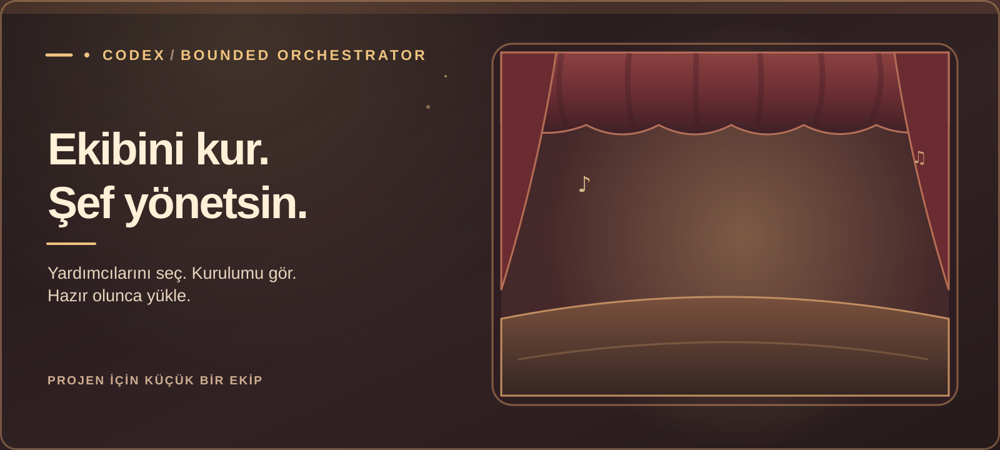
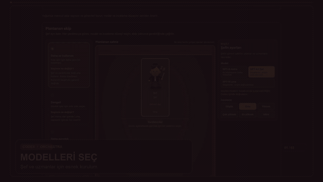
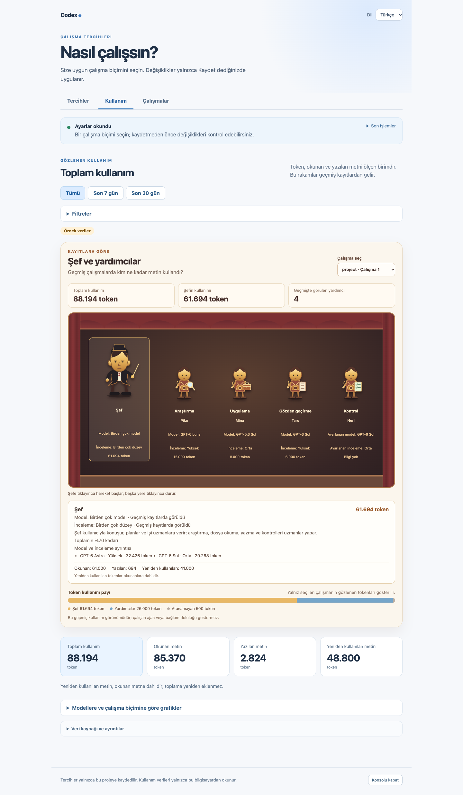
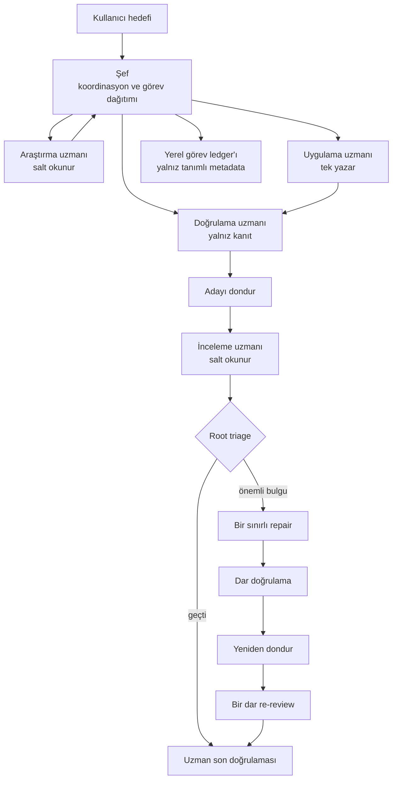

[English](README.md) | [Türkçe](README.tr.md)

<p align="center">
  
</p>

# Codex Bounded Orchestrator

[](LICENSE)
[](https://www.python.org/downloads/)

**Codex projenizin şefini ve uzman ekibini yerel tarayıcı sayfasından seçin.**

Ekibi kurun, değişiklikleri kontrol edin ve geçmiş kullanımı görün. Şef sizinle konuşur ve işleri dağıtır; verilen işleri uzmanlar yapar. Bu görev ayrımı bir talimat kuralıdır, şefin araçlarını teknik olarak kilitlemez.

> [!NOTE]
> Bu bağımsız bir topluluk projesidir. OpenAI ile bağlantılı değildir ve OpenAI tarafından onaylanmamıştır.

## Dört adımda kurulum

Önce Codex, [Git](https://git-scm.com/downloads) ve [Python 3.11 veya yenisi](https://www.python.org/downloads/) kurulu olsun. Python bu indirmeye **dahil değildir**.

1. **İndirin:** [Güncel ZIP dosyasını alın](https://github.com/metapak/codex-bounded-orchestrator/archive/refs/heads/main.zip) ve açılan klasöre girin.
2. **Açın:** Mac'te `launchers` klasöründeki **Bounded Orchestrator.app** dosyasına çift tıklayın. Windows'ta aynı klasördeki **Launch Bounded Orchestrator.vbs** dosyasına çift tıklayın. Linux'ta aşağıdaki kısa komutu kullanın.
3. **Proje seçin:** Mac veya Windows'ta Codex kullandığınız Git proje klasörünü seçin. Linux'ta bu klasörü komutta belirtirsiniz.
4. **Kurun:** Tarayıcıda önerilen ekibi bırakabilir veya değiştirebilirsiniz. **Değişiklikleri kontrol et**, ardından **Kur** düğmesine basın. Codex'i bu projede yeniden başlatın.

<details>
<summary>Linux: aynı kurulum ekranını açın</summary>

Bu pakette Linux için çift tıklamalı başlatıcı veya klasör seçici yoktur. Açtığınız klasörde terminal açın ve Git projenizin yoluyla şu komutu çalıştırın:

```bash
python3 scripts/dashboard.py /projenizin/tam/yolu
```

</details>

Ekibi daha sonra değiştirmek için başlatıcıyı yeniden açıp (Linux'ta komutu yineleyip) **Kaydet** düğmesini kullanın. Ayarlar projeye hemen yazılır; silip yeniden kurmanız gerekmez. Açık Codex oturumunun yeni ayarları kullanması için oturumu yeniden açmanız gerekebilir. Kurulum açılmazsa [Mac](INSTALL-MACOS.md) veya [Windows](INSTALL-WINDOWS.md) rehberine bakın. Codex istemciniz proje ayarlarını ve özel ajanları desteklemeli, seçtiğiniz modellere hesabınızdan erişilebilmelidir.

## 8 saniyelik hareketli önizleme

<p></p>

Sessizdir; Türkçe başlıklar içerir. Örnek Codex Kullanım ekranıdır; canlı veri değildir. [Orijinal MP4 dosyasını indirin](https://raw.githubusercontent.com/metapak/codex-bounded-orchestrator/main/docs/assets/bounded-orchestrator-intro-8s.mp4).



*Temsili demo ekranı; projenizin veya kullanımınızın verilerini göstermez.*

<details>
<summary>İleri kullanım: komut satırı kurulumu ve skill çağrısı</summary>

Komut satırı kurucusu otomasyon için kullanılabilir; yardımcıları tek tek oluşturma ekranı tarayıcı konsolundadır.

```bash
git clone https://github.com/metapak/codex-bounded-orchestrator.git
cd codex-bounded-orchestrator
python3 scripts/install.py /projenin/tam/yolu --preset balanced --dry-run
python3 scripts/install.py /projenin/tam/yolu --preset balanced
```

Seçtiğiniz projede yeni Codex oturumu açın ve repo işlerinde `$bounded-orchestrator` çağırın. Model yönlendirmesine güvenmeden önce [çalışma zamanı kontrolünü](docs/runtime-smoke-test.md) yapın.

</details>

## Artık ne yapıyor?

Siz istediğiniz sonucu normal şekilde anlatırsınız. Şef sınırlı işleri uzmanlara verir, kanıtlarını okur ve sonraki göreve karar verir. Uzman sonucu doğrular, son adayı dondurur ve bağımsız incelemeye sunar. Sistem kesinti ve yeniden deneme geçmişini saklayabilir, yerel kayıtlarda gözlenen token kullanımını gösterebilir, açıkça seçilen projeye özel bir son kontrolü zorunlu tutabilir ve siz eksik kararı verdikten sonra bekleyen göreve devam edebilir.

Yerel tarayıcı konsoluyla macOS ve Windows'ta komut yazmadan seçtiğiniz Git projesine kurulum yapabilirsiniz. Planlanan sahnede on iş türünden birini seçebilir veya 1–50 planlı yardımcı kontrolünü kullanıp bir karaktere tıklayarak görevini, modelini ve uyumlu inceleme düzeyini seçebilirsiniz; şefin de ayrı model ve inceleme seçimi vardır. Aynı görevi birkaç üyeye verebilirsiniz. Bunlar gerçek proje ajan tanımlarıdır. Şef yardımcı sayısına dahil değildir; planlanan ekip hepsini başlatma emri değildir. Ayrı eşzamanlılık sınırı 1–10 arasındadır; 50 yuvanın tümü kaydedilir, sahnede sayfa başına on üye görünür. İş türü kaydedilmemiş ve geri alınabilir taslak önerir. Üç ana yoğunluk seçeneği görevleri/sayıyı koruyup model ve incelemeyi yeniler. Görsel üretimi için ayrıca uygun araç veya bağlantı gerekir. Kullanım sayfası geçmişte gözlenen ajanları, token paylarını ve kayıtlı token toplamlarının tarih şeridini gösterir. Şerit bir oynatma veya çalışma süresi değildir. Orkestra karakterleri görevleri ayırır. Şefe tıklayınca görsel hareket başka yere tıklayana kadar sürer; canlı ajan etkinliği göstermez.

Hazır profillerle dengeli dağılım, en yüksek kalite, daha hafif günlük kullanım, kota tasarrufu veya tamamen özel model ve efor dağılımı seçilebilir. Yerel çalışma yalnızca GPT modelleriyle devam eder. Claude ve DeepSeek, çalışma alanına erişemeyen isteğe bağlı öneri API’leri olarak eklenebilir; kabul edilen değişikliklerin sorumlusu yine yerel GPT uygulayıcıdır.

## Neden kullanılır?

- Şef koordinasyon ve kullanıcı iletişiminden sorumlu kalır; yürütme ve doğrulamayı uzmanlar yapar.
- Her implementasyon kapsamında aynı anda yalnız bir writer çalışır.
- İnceleme, implementasyon, doğrulama ve review birbirinden ayrılır.
- Aday review öncesi dondurulur; sonraki dosya değişiklikleri tespit edilir.
- İnceleme öncesinde görevler, sabit denemeler, kesintiler ve tek sınırlı yeniden deneme yerel ve yalnız metadata tutan ledger ile izlenir.
- İstem içeriğini okumadan veya yazdırmadan yerel model/token sayaçları raporlanabilir.
- Açıkça çalıştırılan yerel değerlendirme isteğe bağlı olarak inceleme öncesinde zorunlu tutulabilir.
- Yetkiyi genişletmeden isteğe bağlı UI tasarımı veya güvenlik review rehberliği eklenir.
- Deneme, writer turu, repair ve re-review sayıları sınırlandırılır.
- Kurulum önceden görüntülenir ve mevcut proje config'i varsayılan olarak korunur.

## Mimari

Yardımcı ekibi projeye göre değişebilir. Bu şema, sabit model listesini değil şef ve uzmanlar arasındaki iş akışını gösterir.


```mermaid
flowchart TD
    U[Kullanıcı hedefi] --> O["Şef<br/>koordinasyon ve görev dağıtımı"]
    O --> E["Araştırma uzmanı<br/>salt okunur"]
    O --> I["Uygulama uzmanı<br/>tek yazar"]
    O --> V["Doğrulama uzmanı<br/>yalnız kanıt"]
    O --> L["Yerel görev ledger'ı<br/>yalnız tanımlı metadata"]
    E --> O
    I --> V
    V --> F[Adayı dondur]
    F --> R["İnceleme uzmanı<br/>salt okunur"]
    R --> T{Root triage}
    T -->|geçti| D[Uzman son doğrulaması]
    T -->|önemli bulgu| B[Bir sınırlı repair]
    B --> V2[Dar doğrulama]
    V2 --> F2[Yeniden dondur]
    F2 --> R2[Bir dar re-review]
    R2 --> D
```

Başka görevler de seçilebilir; modelleri ve inceleme düzeyleri seçtiğiniz ekibe bağlıdır. Ayrıntılar: [mimari dokümanı](docs/architecture.md).

## Platform giriş noktaları

Aşağıdaki giriş noktaları repo içinde sunulur. Gerçek çalışma davranışı yerel Python ve shell ortamına, Codex sürümüne ve model erişimine bağlıdır.

| Platform | Sunulan giriş noktaları | Rehber |
|---|---|---|
| macOS | `launchers/Bounded Orchestrator.app`; terminal için `setup.command` | [macOS kurulumu](INSTALL-MACOS.md) |
| Windows | `launchers/Launch Bounded Orchestrator.vbs`; terminal için `setup.cmd` | [Windows kurulumu](INSTALL-WINDOWS.md) |
| Linux | `python3 scripts/dashboard.py /proje/yolu`; `scripts/install.sh` | [Yerel konsol](docs/local-console.tr.md) ve `--help` |

Installer ve konsol yalnız Python standart kütüphanesini kullanır. Konsol, seçilen projeye yazmadan önce tam değişiklikleri gösterir, ilgisiz ayarları korur ve yönetilen dosyalarla Git tarafından yok sayılan yerel yedekleri izler. Giriş yoluna göre `balanced`, `quality`, `economy`, `quota-saver`, `focused` ve özel yönlendirme seçenekleri bulunur. Bu adlar niyeti anlatır; ölçülmüş tasarruf veya hız garantisi değildir. Yerel roller OpenAI `gpt-*` modellerini kullanır; başka markalar isteğe bağlı API öneri araçlarıdır. Eski `--profile astra|sol` seçeneği çalışmaya devam eder; otomasyonlarda `--preset`, tekrarlanabilir `--role-model ROL=MODEL` ve `--role-effort ROL=EFOR` seçenekleri kullanılabilir.

Tam dağılım için [profil yönlendirme tablosuna](docs/profiles.tr.md) bak.

## İsteğe bağlı haricî API öneri rolü

Varsayılan seçimde haricî sağlayıcı yoktur. Açıkça seçilirse Codex, yerel stdio MCP köprüsü üzerinden Claude (`anthropic`) veya DeepSeek (`deepseek`) modelinden sınırlı bir yama önerisi alabilir. Köprü yalnız görevi, verilen bağlamı, kısıtları ve izinli yolları görür; çalışma alanını okuyamaz veya yazamaz. Öneriyi inceleyip kabul edilen kısmı uygulayan tek writer yerel GPT implementer olarak kalır.

Codex'i başlatmadan önce seçime göre `ANTHROPIC_API_KEY` veya `DEEPSEEK_API_KEY` ortam değişkenini tanımla. Installer anahtarı kaydetmez; yalnız ortam değişkeninin adını config'e yazar. Sağlayıcı API kullanımı ayrıca ücretlendirilebilir. Hazır seçenekler arasında Claude Sonnet/Opus ve DeepSeek V4.1 Flash (`deepseek-flash`) bulunur; aynı sağlayıcı ailesinden özel model kimliği de girilebilir.

```bash
export ANTHROPIC_API_KEY="anahtarın"
python3 scripts/install.py /projenin/tam/yolu \
  --preset balanced --external-provider anthropic \
  --external-model claude-sonnet-5-5 --external-effort high

# Veya güncel DeepSeek V4.1 Flash API adını seç.
export DEEPSEEK_API_KEY="anahtarın"
python3 scripts/install.py /projenin/tam/yolu \
  --preset balanced --external-provider deepseek \
  --external-model deepseek-flash --external-effort high
```

Ayrıntılar için [haricî sağlayıcı kurulumu ve sınırlarına](docs/external-providers.tr.md) bak.

## Neler kurulur?

- `.codex/agents/` altında açık rol kayıtları ve her rol için ayrı profil.
- Konsoldan kaydedildiğinde seçilen her yardımcı için installer tarafından yönetilen bir `team-slot-XX.toml` ajan dosyası.
- `$bounded-orchestrator` skill'i ile görev, review ve escalation sözleşmeleri.
- Candidate hash'leri ve Git kimliği için `.codex/tools/candidate.py`.
- Ignore edilen yerel görev metadata'sı ve tamamlanma kontrolleri için `.codex/tools/ledger.py`.
- İstem veya kod içeriğini göstermeyen yerel model/token raporu için `.codex/tools/usage_report.py`.
- Açıkça seçilen proje kontrolleri için `.codex/tools/local_eval.py` ve örnek ayar dosyası.
- İsteğe bağlı iki uzmanlık paketi: UI tasarımı ve güvenlik review.
- Hedef projenin `AGENTS.md` dosyasında işaretli ve güncellenebilir bir blok.
- Güvenli güncelleme ve uninstall için yerel kurulum manifest'i ile ignore edilen yedek dizini.

`.codex/config.toml` zaten varsa varsayılan kurulum dosyayı korur ve manuel birleştirme için `.codex/bounded-orchestrator.config.example.toml` yazar. Çakışan yönetilen dosyalar `--force` verilmedikçe atlanır. Root config'i yerel yedek alarak değiştirmek için ayrıca `--force-config` seçilmelidir.

```bash
# Çakışan yönetilen rol, skill veya tool dosyalarını yedekleyip değiştir.
python3 scripts/install.py /projenin/yolu --profile astra --force

# Yalnız değiştirilmemiş installer-owned dosyaları ve yönetilen AGENTS.md bloğunu kaldır.
python3 scripts/install.py /projenin/yolu --uninstall

# Kurulu projede adayı dondur ve daha sonra doğrula.
python3 .codex/tools/candidate.py freeze --label pre-review
python3 .codex/tools/candidate.py verify

# Prompt, kaynak veya log saklamadan tanımlanmış zorunlu işleri izle.
python3 .codex/tools/ledger.py start ozellik-123 --title "Kısa hedef etiketi"
python3 .codex/tools/ledger.py add uygula --title "Değişikliği uygula"
python3 .codex/tools/ledger.py status
```

Ayrıntılar için [görev ledger'ı rehberine](docs/task-ledger.tr.md) ve [uzmanlık paketleri rehberine](docs/expertise-packs.tr.md) bak. Ledger tanımlanmış ve çözülmemiş işi tespit edebilir; gereken her işin tanımlandığını kanıtlayamaz. Uzmanlık paketleri talimattır; ek yetki veya teknik enforcement sağlamaz.

## Guardrail'ler ve sınırları

| Kontrol | Nasıl sunulur? | Pratik sınır |
|---|---|---|
| Recursive child delegation kapalı | Agent config'i child agent'ları kapatır; rol prompt'ları da delegation'ı yasaklar | Codex istemcisinin yüklenen proje config'ine uymasına bağlıdır |
| Şef yalnız koordinasyon yapar | Yönetilen AGENTS bloğu ve skill talimatları | Davranış kuralıdır; doğrulanmış köke özel araç izin listesi şefi teknik olarak kilitlemez |
| Kapsam başına tek writer | Owner ve implementer görev sözleşmeleri | Prosedür kuralıdır; dosyaları işletim sistemi düzeyinde kilitlemez |
| Salt okunur reviewer | Reviewer sandbox varsayılanı ve yalnız bulgu talimatı | Gerçek izinler istemciye, trust durumuna ve parent politikasına göre değişebilir |
| Sonlu review döngüsü | Skill state machine'i ve açık bütçeler | Root akışı izlemelidir; prompt'lar global scheduler uygulamaz |
| Candidate bütünlüğü | Yerel araç hash kaydeder ve dondurulmuş dosya kümesini doğrular | Değişikliği tespit eder; düzenlemeyi engellemez veya kod doğruluğunu kanıtlamaz |
| Tanımlanmış iş kontrolü | Yerel ledger review/tamamlama öncesinde görev durumlarını ve bağımlılıkları doğrular | Tanımlanmış çözülmemiş işi bulur; hiç tanımlanmayan işi keşfedemez |
| İsteğe bağlı uzmanlık | Ayrı UI tasarımı ve güvenlik review skill paketleri | Yalnız talimat ekler; izinleri, rolleri veya enforcement'ı değiştirmez |
| Daha güvenli kurulum | Kod çakışmaları korur, dry-run sunar, zorlanan değişimleri yedekler ve sahip olunan dosyaları izler | Ön izleme ve yedekler incelenmelidir; sürüm kontrolünün yerine geçmez |

Asıl uygulama katmanları Codex sandbox'ı, işletim sistemi izinleri, repo korumaları ve insan yetkilendirmesidir. İstemci güncellemelerinden sonra smoke testi tekrar çalıştır; gözlemlenemeyen metadata'yı bilinmiyor olarak raporla.

## Daha fazla bilgi

- [Örnekler](docs/examples.tr.md): özellik geliştirme, bileşenler arası debugging, yüksek riskli değişiklik ve root-only işler
- [SSS ve sorun giderme](docs/faq.tr.md)
- [Yol haritası](docs/roadmap.tr.md)
- [Mimari ayrıntıları](docs/architecture.md)
- [Runtime smoke testi](docs/runtime-smoke-test.md)
- [Görev ledger'ı](docs/task-ledger.tr.md) ve [uzmanlık paketleri](docs/expertise-packs.tr.md)
- [Kullanım raporu ve isteğe bağlı yerel değerlendirme](docs/usage-and-local-eval.tr.md)
- [Yönlendirme profilleri](docs/profiles.tr.md) ve [haricî sağlayıcı köprüsü](docs/external-providers.tr.md)
- [Geçmiş v0.6.0 sürüm notları](docs/release-v0.6.0.tr.md); tarayıcı başlatıcısı için yukarıdaki güncel `main` ZIP dosyasını kullanın
- [Kaynak kökeni](docs/provenance.md)

## Geliştirme

```bash
python3 scripts/validate.py
python3 -m unittest discover -s tests -v
python3 scripts/build_release.py --output-dir dist
```

Katkılar memnuniyetle karşılanır. Pull request açmadan önce [CONTRIBUTING.md](CONTRIBUTING.md), [güvenlik politikası](SECURITY.md) ve [changelog](CHANGELOG.md) dosyalarını oku.

Bu akış Codex işlerini daha net veya daha kolay denetlenir hâle getiriyorsa GitHub yıldızı, başka geliştiricilerin projeyi bulmasına yardımcı olur.

## Lisans ve atıf

Apache-2.0 ile lisanslanmıştır. Bkz. [LICENSE](LICENSE) ve [NOTICE](NOTICE).

Bu proje, yine Apache-2.0 ile dağıtılan [donvito/codex-astra-luna-orchestrator](https://github.com/donvito/codex-astra-luna-orchestrator) projesinden ilham alan sıfırdan bir yeniden tasarımdır. Atıf ve bağlam için [NOTICE](NOTICE) ile [tasarım farklarına](docs/from-astra-luna-orchestrator.md) bak.
